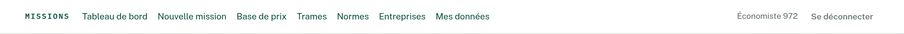
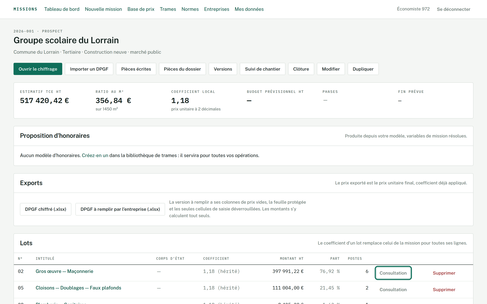
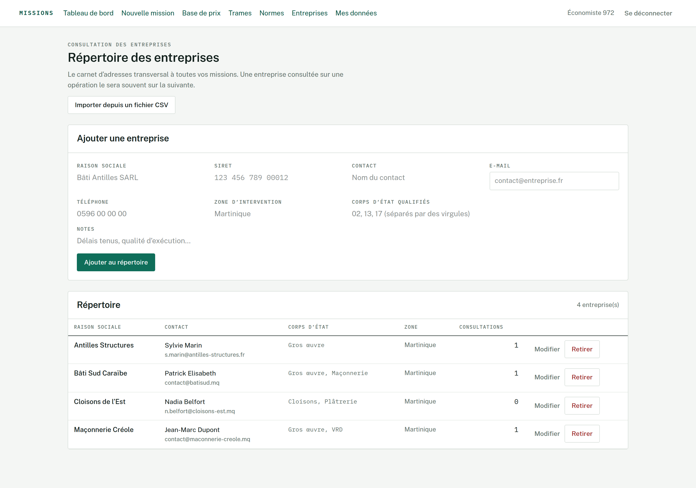
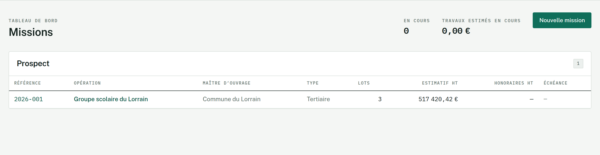
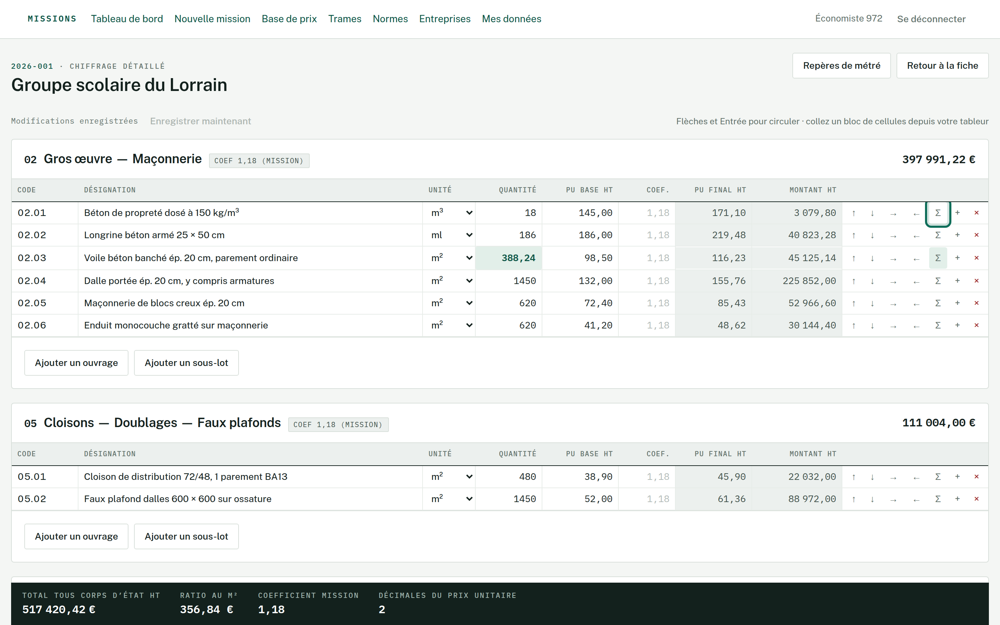
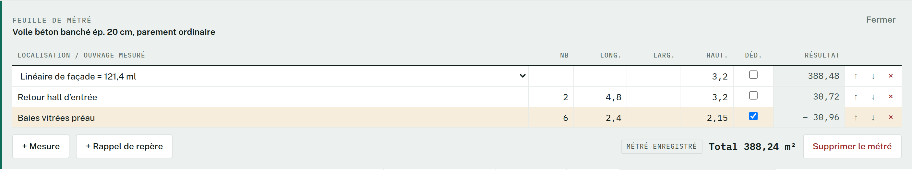
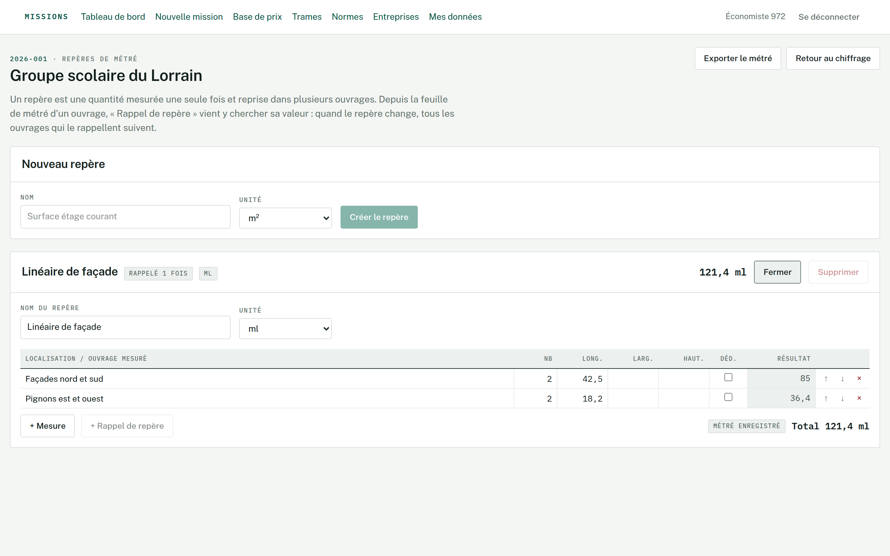
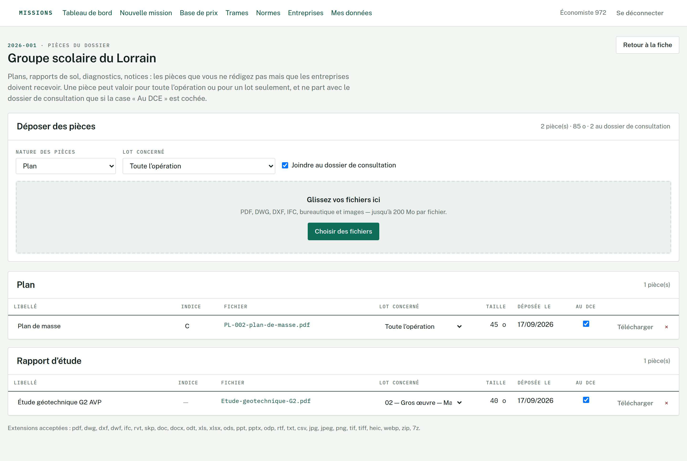
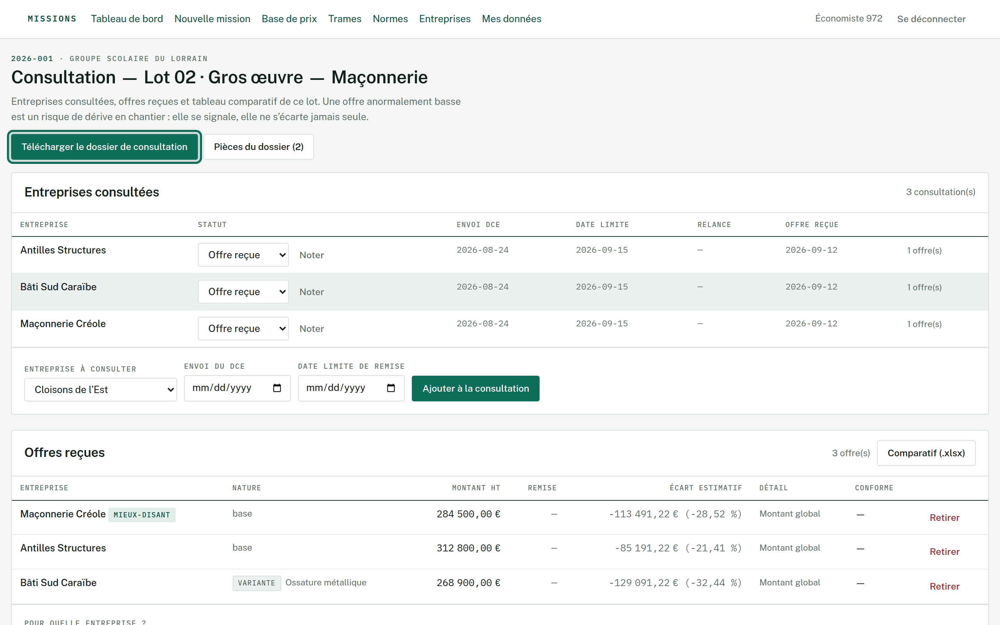
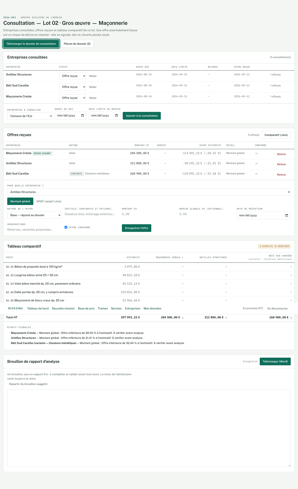

# Guide d'utilisation

Comment se servir de l'application, dans l'ordre où une mission se déroule
réellement.

Pour l'installer et la démarrer, voir **`LANCER-SUR-MON-PC.md`**. Pour le détail
technique de chaque règle de calcul, voir **`README.md`**. Ce guide-ci répond à
une seule question : *où est-ce que je clique, et pourquoi*.

---

## 1. Comprendre l'organisation de l'écran

C'est le point qui surprend au début. L'application a **deux niveaux**, et ils
ne se mélangent pas.

### La barre du haut : ce qui est transversal

| Onglet | Ce qu'on y trouve |
| --- | --- |
| **Tableau de bord** | Toutes vos missions, par statut — et l'archive, repliée en bas |
| **Nouvelle mission** | Créer une opération |
| **Base de prix** | Vos prix unitaires, toutes opérations confondues |
| **Trames** | Vos textes de CCTP réutilisables |
| **Normes** | Votre référentiel de DTU et normes |
| **Entreprises** | Votre carnet d'adresses |
| **Mes données** | Journal des modifications et export complet |

Ces sept écrans ne connaissent aucune mission en particulier. Ce sont **vos
réserves** : elles servent à toutes vos opérations et grossissent avec le temps.

### La fiche de mission : le travail

Tout le reste vit **à l'intérieur d'une mission**. On y entre par le tableau de
bord, et la fiche de mission devient le point de départ de tout : chiffrage,
pièces écrites, consultation, suivi, clôture.

> **Il n'y a donc pas d'onglet « Consultation » en haut.** Ce serait sans objet :
> une consultation concerne un *lot précis d'une mission précise*. On y accède
> depuis la fiche de mission, par le bouton **Consultation** sur la ligne du lot,
> dans le tableau des lots.

C'est la même logique pour le métré, les pièces, les versions, le suivi et la
clôture : ils appartiennent à une mission, donc ils s'ouvrent depuis elle.

---

## 2. Avant la première mission : garnir ses réserves

Rien n'est obligatoire — vous pouvez chiffrer dès le premier jour. Mais ces
quatre écrans sont ce qui fait gagner du temps à partir de la deuxième mission.

### Base de prix

*Base de prix → Ajouter un prix*, ou **Importer un classeur** si vous avez déjà
une bibliothèque sous Excel. Chaque prix porte sa désignation, son unité, son
montant, sa date de relevé et son corps d'état.

L'intérêt vient ensuite : pendant le chiffrage, dès que vous tapez une
désignation, l'application vous propose les prix approchants de votre base. Vous
cliquez, le prix se pose.

### Trames de CCTP

*Trames*. Ce sont vos articles de CCTP rédigés une fois pour toutes. Vous pouvez
les saisir, ou **importer un CCTP Word existant** (*Trames → Import*) : chaque
article du document devient une trame.

Elles servent à deux choses : la génération automatique du CCTP depuis le DPGF,
et la reprise manuelle article par article.

### Entreprises

*Entreprises*. Votre carnet d'adresses, commun à toutes les missions.

**Pour éviter de tout recopier** : *Importer depuis un fichier CSV*. L'export
d'un tableur, d'une messagerie ou d'un logiciel de gestion. Le séparateur et
l'encodage sont reconnus tout seuls ; vous confirmez à quoi correspondent les
colonnes, vous vérifiez l'aperçu, et rien n'est écrit avant votre accord.

Repasser deux fois le même fichier ne double pas le répertoire : une entreprise
déjà connue est reconnue à son SIRET, ou à défaut à sa raison sociale.

### Normes

*Normes*. Le référentiel des DTU que vous entretenez vous-même. L'application ne
télécharge rien — le contenu des DTU est vendu par l'AFNOR et le CSTB. Elle
signale en revanche, au contrôle du DCE, les normes citées dans vos textes qui
sont annulées, remplacées ou inconnues de votre référentiel.

---

## 3. Une mission, du début à la fin

### 3.1 Créer la mission

*Nouvelle mission*. Renseignez l'opération, le maître d'ouvrage, la surface, le
type de marché.

Deux réglages méritent une seconde d'attention, parce qu'ils s'appliquent ensuite
à toute la mission :

- **Le coefficient local** — l'ajustement Martinique appliqué à vos prix de base.
  Il se surcharge par lot, et même ligne par ligne.
- **Les décimales du prix unitaire** — 2 par défaut. C'est la précision à
  laquelle le prix est arrondi *avant* d'être multiplié par la quantité, parce
  que le DPGF imprimé est le document contractuel : l'entreprise recalcule
  quantité × prix affiché, et votre total doit tomber sur le sien.

La référence (`2026-014`) est attribuée automatiquement.

### 3.2 Créer les lots

Sur la fiche de mission, tableau des lots. Numéro, intitulé, corps d'état.
Chaque lot peut porter son propre coefficient.

### 3.3 Le chiffrage

*Fiche de mission → Ouvrir le chiffrage.* C'est l'écran où passe l'essentiel du
temps.

**Se déplacer** : flèches haut et bas, ou Entrée, sans quitter le clavier.

**Coller depuis un tableur** : sélectionnez un bloc dans Excel, collez-le dans la
grille. Les lignes manquantes sont créées. **Une fenêtre vous demande d'abord à
quoi correspondent les colonnes collées** — ce n'est pas une politesse : sans
elle, un tableur qui range le prix avant la quantité les intervertissait en
silence, et le montant était faux sans que rien ne le signale.

**L'assistance au prix** : tapez une désignation, les prix approchants de votre
base apparaissent. Un clic les applique.

**Importer un DPGF entier** : *Fiche de mission → Importer un DPGF*, pour
reprendre un bordereau Excel existant.

**Le coefficient** : affiché en gris clair quand il est hérité, en noir quand il
est propre à la ligne.

**Les totaux** se recalculent à la frappe, avec le même code que le serveur :
l'affichage ne peut pas diverger de ce qui sera enregistré.

### 3.4 Le métré

Plutôt que de taper une quantité venue d'ailleurs, vous pouvez la **calculer**.

Dans la grille, le bouton **Σ** de la ligne d'ouvrage ouvre sa feuille de métré.
Une ligne par mesure : localisation, nombre, longueur, largeur, hauteur. Le
résultat est le produit de ce qui est renseigné — une longueur seule donne un
linéaire, longueur × largeur une surface.

- La case **« Déd. »** fait de la ligne une déduction : la baie dans le mur se
  retranche.
- Dès qu'un ouvrage porte un métré, **sa quantité n'est plus saisissable** — elle
  en est le reflet. « Supprimer le métré » rend la main.
- Si les mesures ne correspondent pas à l'unité de l'ouvrage (une surface pour un
  ouvrage au mètre linéaire), la feuille le dit. C'est un **avertissement**, pas
  un refus.

**Les repères** (*chiffrage → Repères de métré*) sont vos sous-totaux nommés :
« surface étage courant » se mesure une fois, et « + Rappel de repère » vient y
chercher sa valeur dans n'importe quel ouvrage. Quand le repère change, tous les
ouvrages qui le rappellent suivent.

Un rappel se multiplie comme les autres facteurs : rappeler une surface et donner
une épaisseur donne un volume.

*Exporter le métré* produit un classeur à deux feuilles — c'est une pièce
justificative, à sortir quand on vous demande d'où viennent ces 142,50 m².

### 3.5 Les pièces écrites

*Fiche de mission → Pièces écrites.*

**Rédiger** : *Rédaction des textes*, ouvrage par ouvrage. Le format est
volontairement simple — `## ` pour un sous-titre, `- ` pour une puce, une ligne
vide pour un paragraphe.

**Générer depuis vos trames** : *Générer le CCTP depuis vos trames*. Chaque
ouvrage du bordereau est rapproché de votre bibliothèque. Les correspondances
franches arrivent cochées, les approximatives attendent votre regard, les
ouvrages sans trame sont listés à part. **Rien n'est écrit avant que vous
n'appliquiez**, et l'application ne rédige jamais un texte qu'elle n'a pas : un
CCTP est une pièce contractuelle que vous signez.

**Le contrôle de cohérence** tourne avant toute génération : ouvrage sans texte,
quantité nulle, prix à zéro, unité incohérente, norme annulée. Les anomalies
bloquantes empêchent la sortie du CCTP — on peut forcer, mais on sait ce qu'on
fait.

**Sortir les documents** : CCTP, CCAP, CCTG en Word, et en PDF si LibreOffice est
disponible. Le DPGF en Excel, en deux variantes : **chiffré** pour vous, **à
remplir** pour les entreprises.

### 3.6 Les pièces du dossier

*Fiche de mission → Pièces du dossier.*

Plans de l'architecte, rapport de sol, diagnostic amiante, notices : les
documents que vous ne rédigez pas mais que les entreprises doivent recevoir.
Glissez les fichiers, ils partent un par un.

Chaque pièce porte une **nature** (plan, rapport, diagnostic…), un **libellé**
lisible, un **indice de révision** — c'est lui qui distingue deux versions du
même dessin —, un **lot concerné** ou « toute l'opération », et une case
**« au DCE »**. Décochée, la pièce reste chez vous.

### 3.7 Figer une version

*Fiche de mission → Versions.*

À chaque phase (ESQ, APS, APD, PRO, DCE), figez le chiffrage. Une version figée
**ne bouge plus**, quoi qu'il arrive ensuite au chiffrage courant.

Le comparatif entre deux versions ne se contente pas d'un écart global : il
distingue ce qui vient de **lignes apparues ou disparues** de ce qui vient de
**lignes modifiées**. C'est la différence entre « le programme a changé » et
« les prix ont bougé », et ce n'est pas la même conversation avec le maître
d'ouvrage.

Le suivi de chantier s'appuie ensuite sur la version DCE plutôt que sur le
chiffrage courant.

### 3.8 La consultation des entreprises

**C'est ici que vous cherchiez l'onglet.** Il n'y en a pas :

> *Fiche de mission → tableau des lots → bouton **Consultation** sur la ligne du
> lot.*

Sur cet écran, pour ce lot :

- **Ajouter les entreprises consultées**, prises dans votre répertoire, avec
  dates d'envoi du DCE, de limite de remise, de relance.
- **Préparer le courriel** — le bouton ouvre votre messagerie habituelle avec le
  destinataire, l'objet et le corps déjà écrits : le lot, l'opération, la date
  limite de remise, votre signature. Vous relisez, vous joignez le dossier, vous
  envoyez. L'application n'expédie rien elle-même : le message part de votre
  adresse, avec votre accusé de réception.
- **Télécharger le dossier de consultation** — une archive contenant le CCTP, le
  bordereau *à remplir* (jamais vos prix), les pièces qui concernent ce lot
  rangées par nature, et un **bordereau des pièces** qui liste tout avec les
  indices et une empreinte par fichier. C'est ce qui rend une transmission
  vérifiable si quelqu'un soutient plus tard avoir reçu autre chose.
- **Saisir les offres reçues**, de deux façons : un montant global, ou le détail
  ligne à ligne quand l'entreprise a rendu le bordereau rempli.
- **Le tableau comparatif**, qui se construit tout seul.

**Le statut se met à jour tout seul.** Vous ne le saisissez pas : il se déduit
de ce qui est enregistré.

| Statut | Quand |
|---|---|
| **À envoyer** | L'entreprise est dans la liste, le DCE n'est pas parti |
| **DCE envoyé** | Une date d'envoi est posée — le bouton « Préparer le courriel » la pose |
| **Relancée** | Une date de relance est saisie |
| **Offre reçue** | Au moins une offre est enregistrée |
| **Sans réponse** | La date limite est passée, rien n'est arrivé |
| **Désistement** | Vous l'avez noté — c'est le seul que l'application ne peut pas deviner |

Deux conséquences utiles. La bascule en « sans réponse » se fait **le lendemain**
de la date limite : une remise attendue le 15 court jusqu'au soir du 15, vous ne
relancerez pas une entreprise encore dans les temps. Et si vous retirez une
offre, le statut retrouve celui que les dates commandent, au lieu de repartir sur
une valeur choisie d'avance.

### 3.9 L'analyse des offres

Sur le même écran.

**Le classement ne retient que les offres de base conformes.** Une variante
propose autre chose, une option complète : elles figurent au tableau, marquées
« hors classement », mais elles ne concourent pas. Chaque offre porte sa nature —
base, variante, option — et son intitulé.

**Les offres anormalement basses sont signalées**, pas écartées : l'écart se
mesure par rapport à la médiane de sa propre famille — les variantes entre
elles, les bases entre elles — et seulement à partir de trois offres, en deçà
desquelles une médiane ne veut rien dire.

**Une remise globale** est répartie sur les lignes.

**Le brouillon de rapport d'analyse** est un texte modifiable, jamais une
conclusion imposée : c'est vous qui engagez votre responsabilité.

**L'export Excel du comparatif** part au maître d'ouvrage : les montants y sont
des nombres, pas du texte, et ni le prix de base ni le coefficient n'y figurent.

### 3.10 L'attribution et le suivi

**Retenir une offre** vaut attribution : c'est elle qui fixe le marché du lot.
Sans attribution, une situation de travaux n'aurait aucune base.

*Fiche de mission → Suivi de chantier* :

- **Les situations de travaux**, avec avancement par ligne ou global.
- **Retenue de garantie, avance, compte prorata**.
- **Les avenants**, qui modifient le marché.
- **L'alerte de dérive** quand l'écart dépasse le seuil réglé sur la mission.

### 3.11 La clôture

*Fiche de mission → Clôture.*

- **Le décompte général** : marché initial, avenants, travaux réalisés, retenues.
- **Verser les prix réellement pratiqués dans votre base de prix.** C'est le
  moment le plus rentable de toute la mission : les prix du marché réel, ceux
  qui ont vraiment été payés, viennent nourrir votre base pour l'opération
  suivante. Vous cochez ce que vous retenez.
- **L'archivage** de l'opération — voir juste en dessous.

### 3.12 Ranger et supprimer

*Tableau de bord → bouton **Archiver** sur la ligne de la mission.*

Une mission archivée quitte le tableau de bord et cesse d'être comptée dans
« En cours ». Elle n'est pas perdue pour autant : son chiffrage, ses offres et
ses pièces restent intacts, son adresse continue de fonctionner, et **Sortir de
l'archive** la remet exactement où elle était.

L'archivage est volontairement distinct du statut. « Terminée » dit où en est
l'affaire ; archiver dit seulement que vous ne voulez plus la voir. Sans cette
séparation, il faudrait déclarer une opération abandonnée pour désencombrer
l'écran, et votre suivi mentirait.

Les missions rangées sont regroupées sous **Archives**, replié en bas du tableau
de bord.

**La suppression n'est offerte que depuis l'archive.** Il faut donc ranger une
mission avant de pouvoir l'effacer : un geste délibéré s'interpose entre le
tableau de bord et une perte irréversible. Supprimer efface les lots, les postes,
le chiffrage, les offres **et les fichiers déposés sur le disque**. Rien n'en
revient.

> Si vous avez supprimé des missions avec une version antérieure à
> `2026-09-18`, leurs fichiers sont restés dans `donnees\pieces` : l'ancienne
> version n'effaçait que les lignes en base. Ils ne gênent rien, mais ils
> occupent de la place et vos sauvegardes les recopient.

---

## 4. Trois choses à savoir

### Ce qui ne sort jamais vers un tiers

Votre **prix de base** et votre **coefficient d'ajustement** sont internes. Les
documents qui partent — DPGF entreprise, comparatif, dossier de consultation — ne
portent que le prix unitaire final. Une pièce jointe ne part que si sa case
« au DCE » est cochée.

Rien n'est envoyé sur Internet : l'application tourne entièrement sur votre PC.

### Ce qui est signalé plutôt que deviné

C'est le principe de fond. À l'import, au collage, dans le métré : une valeur
qu'on ne sait pas lire produit une **anomalie nommée**, avec son numéro de ligne,
jamais un zéro silencieux ni une correction d'autorité. Un SIRET dont la clé ne
tombe pas juste entre en base tel quel, signalé — c'est votre fichier, et c'est à
vous de trancher.

### Les sauvegardes

`Sauvegarder.bat` écrit deux choses dans le dossier `sauvegardes` : la base
(`.sql`) **et** une copie des pièces déposées, qui ne sont pas dans la base.
**Copiez les deux ailleurs** — disque externe, ou service en ligne. Une
sauvegarde qui dort à côté de l'original ne protège de rien.

Second filet, indépendant : *Mes données → Télécharger l'archive*. Un zip avec
les bordereaux en Excel, les textes en fichiers texte et le reste en JSON. Il se
relit sans l'application, même dans dix ans.

---

## 5. Où trouver quoi

| Je veux… | J'y vais par |
| --- | --- |
| Créer une opération | Barre du haut → *Nouvelle mission* |
| Chiffrer | Fiche de mission → *Ouvrir le chiffrage* |
| Calculer une quantité | Chiffrage → bouton **Σ** sur la ligne |
| Mesurer une fois pour plusieurs ouvrages | Chiffrage → *Repères de métré* |
| Reprendre un DPGF Excel | Fiche de mission → *Importer un DPGF* |
| Rédiger le CCTP | Fiche de mission → *Pièces écrites* |
| Générer le CCTP depuis mes trames | Pièces écrites → *Générer le CCTP* |
| Déposer des plans | Fiche de mission → *Pièces du dossier* |
| Figer une phase | Fiche de mission → *Versions* |
| **Consulter les entreprises** | **Fiche de mission → ligne du lot → *Consultation*** |
| **Saisir une offre** | **Même écran, dans le lot concerné** |
| Envoyer le DCE | Consultation du lot → *Télécharger le dossier de consultation* |
| Comparer les offres | Consultation du lot, tableau comparatif |
| Attribuer | Consultation du lot → retenir une offre |
| Suivre le chantier | Fiche de mission → *Suivi de chantier* |
| Solder l'opération | Fiche de mission → *Clôture* |
| Enrichir ma base de prix | Clôture → verser les prix réels, ou *Base de prix* |
| Importer mon carnet d'adresses | *Entreprises* → *Importer depuis un fichier CSV* |
| Retrouver qui a changé quoi | *Mes données* → journal |

---

## 6. Quand ça coince

**Lancez `Diagnostic.bat`** et lisez les deux premières lignes : la version des
fichiers du dossier et celle de l'image qui tourne. **Elles doivent être
identiques.** Si elles diffèrent, l'application tourne encore sur l'ancienne
version — `Reconstruire.bat` règle la question.

Le reste des pannes connues, avec leur remède, est dans `LANCER-SUR-MON-PC.md`,
section « Si ça coince ».
